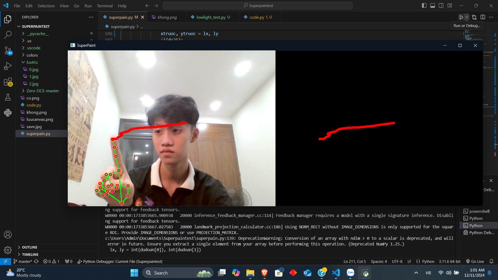
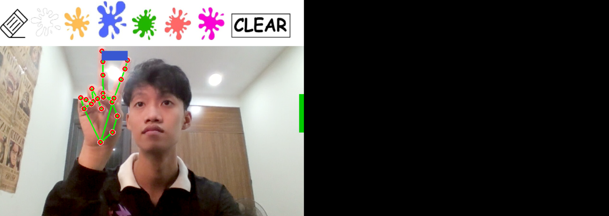

# Magic Draw

Magic Draw là một ứng dụng vẽ bằng cử chỉ tay sử dụng OpenCV, Mediapipe và Tkinter. Ứng dụng cho phép người dùng vẽ bằng cách di chuyển ngón tay trước webcam.

## 🚀 Tính năng chính

- Giao diện menu thân thiện với các tùy chọn:
  - Vẽ tranh
  - Hướng dẫn sử dụng
  - Thoát
- Sử dụng OpenCV để xử lý hình ảnh từ webcam
- Nhận diện bàn tay bằng Mediapipe
- Cho phép vẽ trên canvas ảo bằng cử chỉ tay
- Chọn màu vẽ từ bảng màu
- Lưu tranh vẽ vào thư mục `luutru`
- Giao diện hướng dẫn sử dụng trực quan

## 🛠️ Công nghệ sử dụng

- Python
- OpenCV
- Mediapipe
- Tkinter
- NumPy
- PIL (Pillow)

## 📂 Cấu trúc thư mục

```
MagicDraw/
│-- colors/               # Thư mục chứa bảng màu
│-- luutru/               # Thư mục lưu tranh vẽ
│-- images/               # Thư mục chứa hình ảnh hướng dẫn
│-- magic_draw.py         # File mã nguồn chính
│-- README.md             # Hướng dẫn sử dụng
```

## 🔧 Cài đặt

1. **Clone repository:**

   ```sh
   git clone https://github.com/your-username/MagicDraw.git
   cd MagicDraw
   ```

2. **Cài đặt các thư viện cần thiết:**

   ```sh
   pip install opencv-python mediapipe numpy pillow
   ```

## 🎨 Cách sử dụng

1. Chạy chương trình:
   ```sh
   python magic_draw.py
   ```
2. Giao diện menu sẽ xuất hiện, chọn một tùy chọn:
   - **Vẽ Tranh**: Mở giao diện vẽ tranh
   - **Hướng Dẫn**: Hiển thị hướng dẫn sử dụng
   - **Thoát**: Đóng chương trình
3. Trong chế độ vẽ tranh:
   - Di chuyển ngón tay để vẽ
   - Giơ hai ngón tay lên để chọn màu
   - Vuốt xuống để lưu tranh
   - Nhấn `q` để thoát

## 📌 Phím tắt

- `q` - Thoát khỏi chế độ vẽ
- `Esc` - Đóng chương trình

## 📸 Hình ảnh minh họa




## 📜 Giấy phép

Dự án này được phát hành dưới giấy phép MIT.

## 🤝 Đóng góp

Mọi đóng góp đều được hoan nghênh! Hãy tạo một pull request hoặc issue nếu bạn có ý tưởng cải tiến.

---

✨ Chúc bạn có những giờ phút sáng tạo vui vẻ với Magic Draw! ✨

